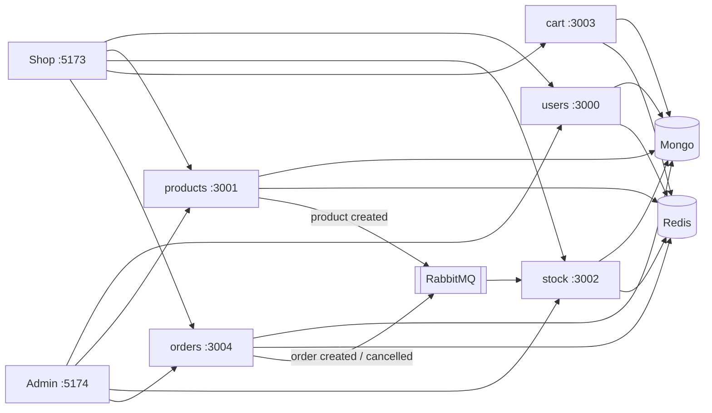

# Core Platform

This folder is the **shop backend**, the **shop website** (`apps/web`), and a **staff admin** (`apps/admin`).

The website talks to the five APIs. It keeps you logged in with **cookies** (not `localStorage`).

## Which file should I read?

| I want to… | Open |
|---|---|
| Understand the whole project | This file |
| See how the pieces connect | [docs/architecture.md](docs/architecture.md) |
| Understand Redis (when / why / not) | [docs/redis.md](docs/redis.md) |
| Understand login, cookies, Bearer, CSRF | [docs/security.md](docs/security.md) |
| Understand stock updates after an order | [docs/rabbitmq.md](docs/rabbitmq.md) |
| Build the shop or admin UI | [docs/frontend.md](docs/frontend.md) |
| Put this on the internet | [docs/deploy.md](docs/deploy.md) |
| See shared code used by every service | [docs/common.md](docs/common.md) |
| Click through the APIs in Postman | [docs/postman.md](docs/postman.md) |
| Match folder names (Layout vs Shell, Nest features) | [docs/conventions.md](docs/conventions.md) |
| Explain the system in an interview | [docs/interview.md](docs/interview.md) |

## Simple picture

Five APIs, two websites, Mongo, Redis, and RabbitMQ. Full diagrams: [docs/architecture.md](docs/architecture.md).



| Program | Port | What it stores | Like this page on a shop |
|---|---|---|---|
| user-service | 3000 | Accounts, login, addresses | Sign in, my profile |
| product-service | 3001 | Products, categories, storefront, image files | Home, product page, logo |
| inventory-service | 3002 | How many are in stock | “In stock” |
| cart-service | 3003 | Signed-in cart | Cart after login |
| order-service | 3004 | Your orders | Checkout, my orders |

Anyone can **look at products and fill a cart** without logging in (like Amazon). **Checkout and order history** need an account. Amazon.com does not let you complete a purchase as a true guest either: sign-in happens after the cart, not before “add to cart.”

When you place an order, the order program saves it and an **outbox row** in one Mongo transaction (prices come from product-service — the browser cannot set them). A background relay publishes to RabbitMQ so stock can hold those items — usually within a couple of seconds. Send header `Idempotency-Key` on checkout to survive double-clicks or network retries.

Login uses two passes:

- a **short** one (~15 minutes) for each request
- a **long** one (~7 days) only to get a new short one when the short one expires

The website should keep those in **cookies**, not in `localStorage`. Details: [docs/security.md](docs/security.md).

## A customer’s path

Same shape as Amazon:

1. Open the catalog — no login. Categories are taxonomy (Apparel, Shoes). **Featured** is a flag on a product, not a category.
2. Add to cart as a guest. The shop keeps those lines in the browser until you sign in. (Amazon keeps a guest cart in a session cookie; our cart API is still per account.)
3. Open **Cart**. Still no login.
4. **Proceed to checkout** → register or log in. The guest cart is copied onto your account.
5. Confirm **shipping address** (saved on the user, copied onto the order) and place the order. Stock is reserved shortly after, via a message.
6. If a request says “not logged in” (401), ask for a new short pass, then try again.
7. Log out. The long pass is thrown away. The short one may still work for a few minutes.

## Run it on your computer

```bash
npm install

cp apps/user-service/.env.example apps/user-service/.env
cp apps/product-service/.env.example apps/product-service/.env
cp apps/inventory-service/.env.example apps/inventory-service/.env
cp apps/cart-service/.env.example apps/cart-service/.env
cp apps/order-service/.env.example apps/order-service/.env

docker compose up -d
# Starts Mongo replica set (27017), Redis (6379), and RabbitMQ (5672).
# First start may take ~15s while Mongo runs rs.initiate().
# Rabbit web UI: http://localhost:15672  user guest, password guest

npx nx serve user-service
npx nx serve product-service
npx nx serve inventory-service
npx nx serve cart-service
npx nx serve order-service
npx nx serve web                 # shop  http://localhost:5173
npx nx serve admin               # admin http://localhost:5174
```

The shop site is **http://localhost:5173**. The staff panel is **http://localhost:5174**. APIs must be running too. Start **inventory** before you create products, so stock rows can be created automatically.

Staff login uses the same users as the shop. The email in `ADMIN_EMAIL` (default `ada@example.com`) is promoted to **admin** on login. Log out and back in once after that change so the pass includes the role.

## Admin panel

A **separate app** (`apps/admin`) so the storefront stays a shop. It talks to the same APIs.

| Screen | What you can do |
|---|---|
| Branding | **Site name**, favicon, logo, home hero, promo tiles, **currency** |
| People | Add/delete admins and customers, address, change role |
| Products | Add/delete, assign category, featured flag |
| Categories | Add/delete taxonomy |
| Inventory | Set on-hand quantity |
| Sales | All orders and a simple gross total |

Payment is not in this panel. Catalog writes and stock sets require the admin role.

## Catalog: categories vs featured

These are different fields. A product can be **both**.

| | What it is | In the database | Shop URL |
|---|---|---|---|
| **Category** | Taxonomy (type of product) | `categories` collection: Apparel, Shoes, Bags, … Product has `category: "apparel"` | `/shop/apparel` |
| **Featured** | Merchandising flag (home-row pick) | `featured: true` on the **product**. Not a category row | `/shop?featured=1` |
| **All** | Unfiltered catalog | Not a category | `/shop` |

Do **not** store `all` or `featured` as categories. The shop chips are exclusive: All, one category, or Featured.

Example: Cloud Zip Hoodie can be `category: apparel` and `featured: true`. It shows under Apparel **and** under Featured.

Create categories first, then products. Product `category` must be a real category slug. The admin panel can do this from the UI.

Check it is up:

```bash
curl http://localhost:3000/api/health/live
```

## Settings (`.env`)

Copy `.env.example` to `.env` in each app. Do not commit real secrets.

| Name | Meaning |
|---|---|
| `PORT` | Which port this program listens on |
| `MONGO_URI` | Where this program’s data lives (`?replicaSet=rs0` for local Docker) |
| `RABBITMQ_URL` | Where messages go (`amqp://localhost:5672`) |
| `REDIS_URL` | Shared cache and rate limits (`redis://localhost:6379`) |
| `JWT_SECRET` | Secret for the short pass — **must be the same** in every app |
| `JWT_REFRESH_SECRET` | Secret for the long pass |
| `JWT_ACCESS_EXPIRES_IN` | Default `15m` |
| `JWT_REFRESH_EXPIRES_IN` | Default `7d` |
| `CORS_ORIGIN` | Which website is allowed to call the API (shop 5173 and admin 5174) |
| `ADMIN_EMAIL` | user-service only — this email is admin on login |
| `STOREFRONT_UPLOAD_DIR` | product-service only — where logo/hero/promo files are saved |
| `PRODUCT_SERVICE_URL` | order-service only — where to read live product prices |
| `OUTBOX_POLL_MS` | order-service only — how often the outbox relay checks Rabbit (default `2000`) |
| `TRUST_PROXY` | `true` behind a gateway so rate limits use the real client IP |
| `COOKIE_SECURE` | `false` on http://localhost; `true` on https |
| `NODE_ENV=production` | Stricter rules (real secrets, real website URL) |

## If something goes wrong

| Code | Meaning |
|---|---|
| 400 | Bad input (missing field, extra field) |
| 401 | Not logged in, or pass expired |
| 403 | Browser cookie login missing a security header (CSRF) |
| 404 | Not found |
| 409 | Email or product code already used |
| 429 | Too many login tries; wait a minute |
| 500 | Server bug |

`/api/health/live` = the program is running. `/api/health/ready` = it can talk to the database (and Redis / messages, if it uses them).

## Production patterns (honest summary)

| Area | What we do |
|---|---|
| Rate limits | Redis-backed counters on all APIs; login 5/min, checkout 10/min |
| Auth | HttpOnly cookies + CSRF; JWT verified per service; logout denylist in Redis |
| Checkout | Server-side pricing; optional `Idempotency-Key`; Mongo unique index per user |
| Events | **Transactional outbox** on orders (Mongo + outbox in one transaction); relay publishes to Rabbit; idempotent inventory handlers; DLQ |
| Cache | ~45s catalog cache in Redis; generation bump on writes |
| Scale | Stateless APIs — run more copies behind one gateway; set `TRUST_PROXY=true` |

**Not yet:** circuit breakers, metrics/tracing, HA image storage, payments. See [docs/interview.md](docs/interview.md).

## Folders

```
apps/user-service        login and users
apps/product-service     products, categories, storefront + uploads
apps/inventory-service   stock
apps/cart-service        carts
apps/order-service       orders + outbox relay
packages/common          shared start-up, login check, messages, Redis
apps/web                 React shop (Vite, port 5173)
apps/admin               React staff panel (Vite, port 5174)
docs/                    guides (architecture, security, frontend, …)
postman/                 click-to-run API collection
```
