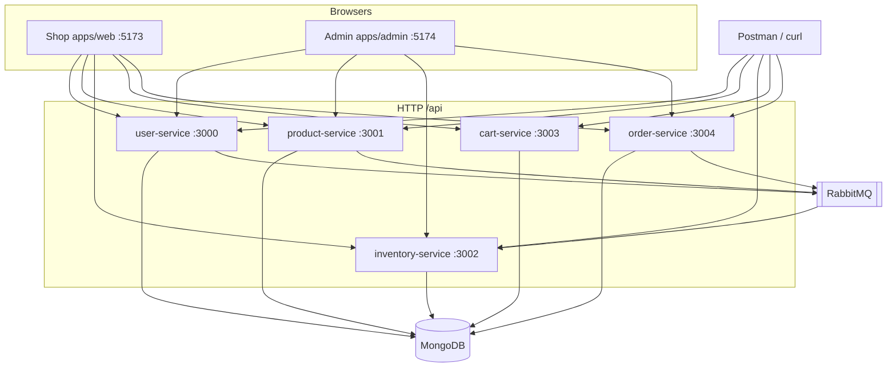
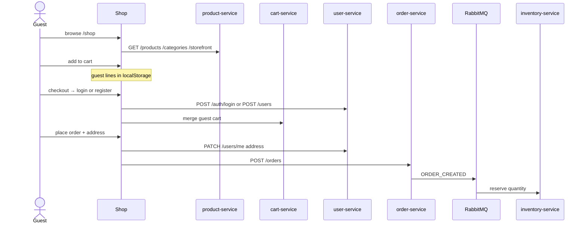

# Architecture

swoop is an Nx monorepo: **five NestJS APIs**, a **shop** (`apps/web`), and a **staff admin** (`apps/admin`). Shared start-up and auth live in `@core-platform/common`.

Prices are integer **minor units**. Display currency is `storefront.currency`. Login is **HttpOnly cookies + CSRF** (Postman may send Bearer).

## System



Admin does not call cart-service. Guests keep a cart in the **browser** until login; then it is merged into cart-service.

## What each API owns

| App | Port | Mongo | HTTP | Events |
|---|---|---|---|---|
| user-service | 3000 | users | register, login, me, admin people | USER_CREATED / USER_UPDATED |
| product-service | 3001 | products, categories, storefront | catalog, storefront, **image files** | PRODUCT_CREATED |
| inventory-service | 3002 | stock | get / set quantity | listens: product created, order created/cancelled |
| cart-service | 3003 | carts | cart for a logged-in user | — |
| order-service | 3004 | orders | checkout, my orders, admin sales | ORDER_CREATED / ORDER_CANCELLED |

`packages/common`: `bootstrapNestApp`, JWT guards, `@Public` / `@Roles('admin')`, CORS, health, Rabbit publisher.

## Shopper path



## Frontend layers

Same folders in shop and admin:

```
URL → routes/router.tsx → pages → hooks → features (Redux) → api/http.ts → :3000–3004
```

Chrome is `Layout`. Gates are `ProtectedRoute` and `GuestRoute`. Render crashes: `components/ErrorBoundary` (around the tree) and `errorElement` → `RouteError` (inside the router, so the header/sidebar can stay).

## Folder map

```
apps/user-service        accounts
apps/product-service     products, categories, storefront + uploads
apps/inventory-service   on-hand / reserved
apps/cart-service        signed-in carts
apps/order-service       orders
packages/common          bootstrap, auth, messaging
apps/web                 shop UI
apps/admin               staff UI
docs/                    this file and the other guides
```
