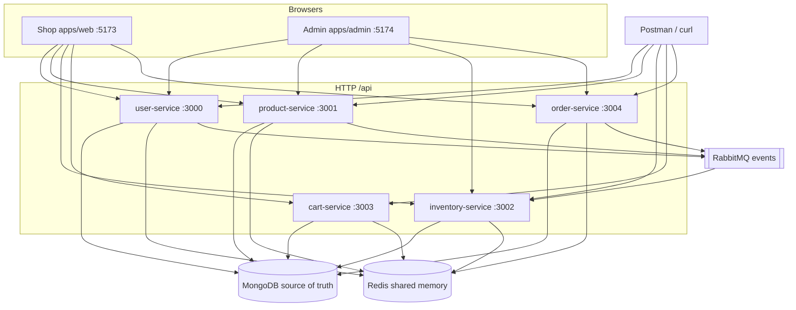
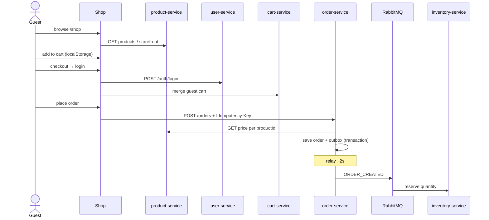

# Architecture — how the whole shop fits together

**For newcomers:** Imagine five small backend programs instead of one big server. Each program owns one job (users, products, stock, cart, orders). They share MongoDB for real data, Redis for short-lived shared stuff, and RabbitMQ for “something happened” messages. Two websites (shop + admin) call those programs over HTTP.

**Prices** are integer **cents**. **Login** uses HttpOnly cookies + CSRF on the shop (Postman uses Bearer). Deep dives: [security.md](security.md) · [redis.md](redis.md) · [rabbitmq.md](rabbitmq.md).

---

## The picture



- **Admin** does not call cart-service.
- **Guests** keep a cart in the **browser** until login; then it merges into cart-service.
- **Mongo** = durable records. **Redis** = rate limits, logout list, short catalog cache. **RabbitMQ** = async notes between services.

---

## What each API owns

| App | Port | Mongo | Redis | Main job |
|-----|------|-------|-------|----------|
| user-service | 3000 | users, refresh hash | throttle, denylist write | Register, login, profile, admin people |
| product-service | 3001 | products, categories, storefront | catalog cache | Catalog, branding images |
| inventory-service | 3002 | stock rows | throttle only | On-hand + reserved quantity |
| cart-service | 3003 | carts | throttle only | Signed-in user’s cart |
| order-service | 3004 | orders, **outbox** | throttle only | Checkout, order history, outbox relay |

Shared code: `@core-platform/common` — bootstrap, JWT guards, Redis, Rabbit, health.

Local Mongo runs as replica set **`rs0`** so order + outbox can use **transactions**. Every `MONGO_URI` needs `?replicaSet=rs0` locally.

---

## Shopper journey (step by step)

This is the story you tell in an interview.

1. **Browse** — No login. Shop calls product-service for products, categories, storefront.
2. **Add to cart** — Lines saved in **browser** `localStorage` (guest has no user id yet).
3. **Open cart** — Still no login required.
4. **Checkout** — Register or login. Guest cart **merges** into cart-service.
5. **Place order** — Browser sends only `productId` + `quantity`. order-service **fetches prices** from product-service, saves order + **outbox row** in one Mongo transaction.
6. **Stock** — Background relay (~2s) publishes `ORDER_CREATED` to Rabbit → inventory **reserves** stock.
7. **Logout** — Refresh revoked in Mongo; access JWT **denylisted** in Redis.



---

## Catalog rules (easy to get wrong)

| | What it is | In DB | Shop URL |
|--|------------|-------|----------|
| **Category** | Taxonomy (Apparel, Shoes) | `category: "apparel"` on product | `/shop/apparel` |
| **Featured** | Home-page pick | `featured: true` on product — **not** a category | Home only |
| **All** | Full catalog | Not a category row | `/shop` |

Never create category rows named `all` or `featured`.

---

## Resilience (what we handle today)

| Problem | How we handle it |
|---------|------------------|
| Brute-force login | Redis rate limit (5/min) shared across all APIs |
| Double checkout | `Idempotency-Key` + unique Mongo index |
| Price tampering | Server-side pricing at checkout |
| Lost Rabbit message | Transactional **outbox** for orders |
| Duplicate Rabbit delivery | Idempotent inventory handlers + DLQ |
| Redis down | Throttle/denylist fail open; catalog reads Mongo |

---

## What breaks if X is down?

| Component | What happens |
|-----------|--------------|
| **Mongo** | Nothing durable works; `/health/ready` fails |
| **Redis** | Limits/denylist fail open; catalog slower (hits Mongo) |
| **RabbitMQ** | Orders still save; stock reserve delayed (outbox waits) |
| **product-service** | No catalog; checkout cannot price |
| **order-service** | Cannot place orders |
| **inventory-service** | Orders succeed; `reserved` count stale until consumer runs |

What we have **not** built: [roadmap.md](roadmap.md).

---

## Frontend layout (shop and admin)

```
URL → routes → pages → hooks → TanStack Query → api/http.ts → ports 3000–3004
```

Chrome: `Layout`. Auth gates: `ProtectedRoute`, `GuestRoute`. Errors: `ErrorBoundary` + `RouteError`.

---

## How to explain this in an interview

**Why microservices for a small shop?**  
“We wanted clear boundaries and a realistic demo. Catalog is read-heavy; orders write money totals; stock reacts to events. A monolith would work at this traffic — we chose services to show ownership and async stock.”

**Why guest cart in the browser?**  
“cart-service keys carts by `userId`. Guests have no id until login. localStorage matches common retail UX — browse and cart before account.”

**Walk me through checkout.**  
Use the shopper journey above. Emphasize: server pricing, idempotency key, outbox + async reserve.

**Monolith vs microservices tradeoff?**  
“More moving parts locally (five ports). Win: independent deploy, smaller blast radius, read-heavy catalog can scale separately.”
