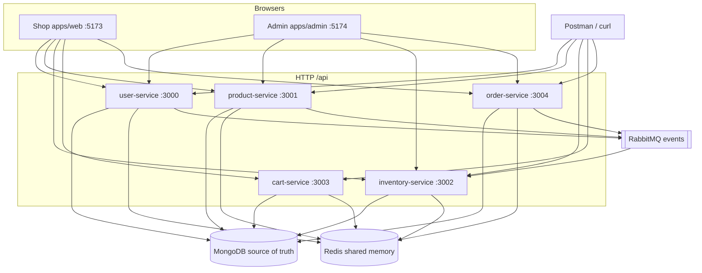
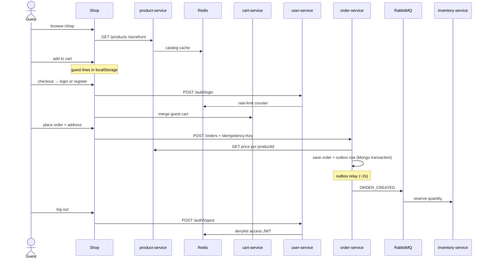

# Architecture

swoop is an Nx monorepo: **five NestJS APIs**, a **shop** (`apps/web`), and a **staff admin** (`apps/admin`). Shared start-up and auth live in `@core-platform/common`.

Prices are integer **minor units**. Display currency is `storefront.currency`. Login is **HttpOnly cookies + CSRF** (Postman may send Bearer).

## System



Admin does not call cart-service. Guests keep a cart in the **browser** until login; then it is merged into cart-service.

**Mongo** = durable records. **Redis** = rate limits, logged-out access tokens, short catalog cache. **RabbitMQ** = “order created” style notes. Details: [redis.md](redis.md), [rabbitmq.md](rabbitmq.md).

Interview walkthrough: [interview.md](interview.md).

## Resilience (what we handle today)

| Concern | Approach |
|---|---|
| Brute-force login | Redis throttle — shared across all API instances |
| Double checkout | `Idempotency-Key` + unique `{ userId, idempotencyKey }` index |
| Price tampering | order-service reads price from product-service at checkout |
| Duplicate events | Inventory handlers idempotent; DLQ for poison messages |
| Order → Rabbit | **Transactional outbox** — order + outbox row in one Mongo transaction; relay polls and publishes |
| Publish blip | EventPublisher retries 3 times per outbox row; row stays until `publishedAt` is set |
| Redis outage | Throttle/denylist fail open; catalog reads Mongo |
| Gateway IP | `trust proxy` when `TRUST_PROXY=true` or production |

Local Docker runs Mongo as a **single-node replica set** (`rs0`) so transactions work. Use `?replicaSet=rs0` in every `MONGO_URI`.

## What each API owns

| App | Port | Mongo | Redis | HTTP | Events |
|---|---|---|---|---|---|
| user-service | 3000 | users, refresh hash | denylist on logout; throttle | register, login, me, admin people | USER_CREATED / USER_UPDATED |
| product-service | 3001 | products, categories, storefront | catalog cache | catalog, storefront, **image files** | PRODUCT_CREATED |
| inventory-service | 3002 | stock | throttle only | get / set quantity | listens: product created, order created/cancelled |
| cart-service | 3003 | carts | throttle only | cart for a logged-in user | — |
| order-service | 3004 | orders, **outbox** | throttle only | checkout (server prices), my orders, admin sales | ORDER_CREATED / ORDER_CANCELLED (via outbox relay) |

`packages/common`: `bootstrapNestApp`, JWT guards, `@Public` / `@Roles('admin')`, CORS, health, Rabbit publisher, Redis client.

## Shopper path



## Frontend layers

Same folders in shop and admin:

```
URL → routes/router.tsx → pages → hooks → features (Redux) → api/http.ts → :3000–3004
```

Chrome is `Layout`. Gates are `ProtectedRoute` and `GuestRoute`. Render crashes: `components/ErrorBoundary` (around the tree) and `errorElement` → `RouteError` (inside the router, so the header/sidebar can stay).

## Folder map

```
apps/user-service        accounts
apps/product-service     products, categories, storefront + uploads
apps/inventory-service   on-hand / reserved
apps/cart-service        signed-in carts
apps/order-service       orders + outbox relay
packages/common          bootstrap, auth, messaging, redis
apps/web                 shop UI
apps/admin               staff UI
docs/                    this file and the other guides
```
