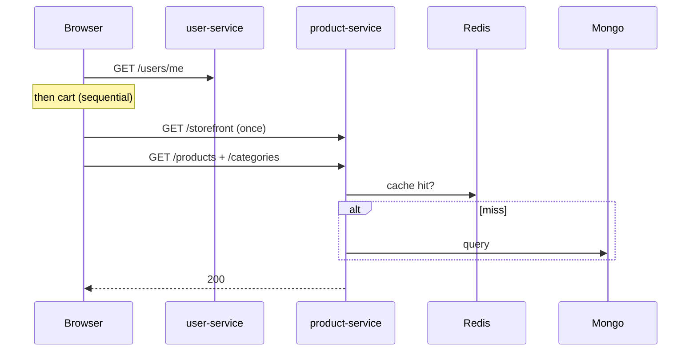

# Performance — speed, HTTP codes, and caching

**For newcomers:** “Slow API” can mean three different things: the **browser** reusing old data (304), the **server** skipping Mongo thanks to Redis, or **local dev** cold start after restart. This doc explains all three in plain language.

Redis details: [redis.md](redis.md). Request flow: [architecture.md](architecture.md).

---

## HTTP status codes

| Code | Meaning | In swoop |
|------|---------|----------|
| **200** | Success | Normal response |
| **201** | Created | New resource saved |
| **304** | Not modified — use your cache | **Not an error** — see below |
| **400** | Bad request body | Validation failed |
| **401** | Not logged in / bad token | Login or refresh |
| **403** | Forbidden | Missing CSRF or not admin |
| **404** | Not found | Bad id or route |
| **409** | Conflict | Duplicate email or SKU |
| **429** | Too many requests | Rate limit |
| **500** | Server error | Check service logs |

Health: `/api/health/live` = process up. `/api/health/ready` = Mongo (+ Redis/Rabbit if used).

---

## What is **304 Not Modified**?

You asked about this — it confuses many beginners.

1. First `GET /api/products` → **200** + JSON. Server may send an **ETag** (fingerprint).
2. Browser asks again with `If-None-Match: <etag>`.
3. Nothing changed → **304** with **no body** — “use what you already downloaded.”

**304 = success.** Your app still has the data from the first 200.

| Where | Why |
|-------|-----|
| Browser DevTools | Repeat GET same URL |
| Branding images | `Cache-Control: immutable` for a year |
| Postman | Only if caching on — often you see 200 every time |

---

## Three caching layers (do not mix them up)

| Layer | Where | You see | TTL |
|-------|-------|---------|-----|
| Browser HTTP | Client | **304** or disk cache | ETag / Cache-Control |
| Redis catalog | product-service server | **200** (Redis is invisible to client) | ~45s |
| None | user, cart, order | **200** | Always Mongo |

Login, cart, and orders are **never** Redis-cached.

---

## First shop load (what the browser calls)

Every API call also touches Redis for **rate limiting** first.

---

## Why APIs feel slow after restart (local dev)

| Cause | Explanation |
|-------|-------------|
| Empty Redis catalog cache | First reads hit Mongo |
| Five services restarting | Webpack + reconnect on one laptop |
| Mongo replica set | `rs0` needed for transactions — slightly heavier |
| Cold connections | First Mongo/Redis use after boot |
| Refresh too early | APIs not listening yet on all ports |
| Uncached paths | Auth and cart always use Mongo |

**Quick test:** `GET /api/products` twice — second should feel faster. **304** on repeat in browser is also healthy.

---

## What we optimized

| Done | Why |
|------|-----|
| Redis catalog cache + generation bump | Fewer Mongo reads on home/shop |
| `.lean()` on catalog queries | Less Mongo overhead |
| Indexes on orders | Faster lookup by user + idempotency key |
| Stateless APIs | Scale horizontally behind gateway |
| Transactional outbox | Fast HTTP; stock async |
| Idempotent handlers + Idempotency-Key | Safe retries |

| Not done (on purpose) | See |
|-----------------------|-----|
| CDN, read replicas, circuit breakers | [roadmap.md](roadmap.md) |
| Cache carts/orders in Redis | Mongo must stay truth |

---

## How to explain this in an interview

**What is 304?**  
“Browser cache hit — content unchanged, use local copy. Not an error. Different from our Redis server cache.”

**Why slow after restart?**  
“Local cold start: empty catalog cache, five services recompiling, connection warm-up. Not a design flaw.”

**How do you make the catalog fast?**  
“~45s Redis cache with generation bump on admin writes. Browser may also 304 on repeat GETs.”

**What would you add at scale?**  
“CDN for images, read replicas, metrics/tracing — in roadmap, not over-built for demo traffic.”
